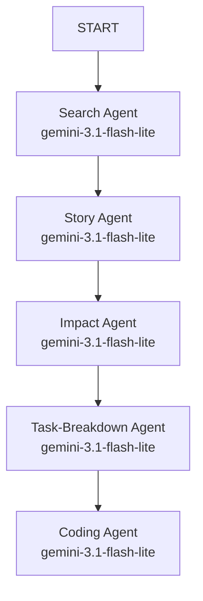
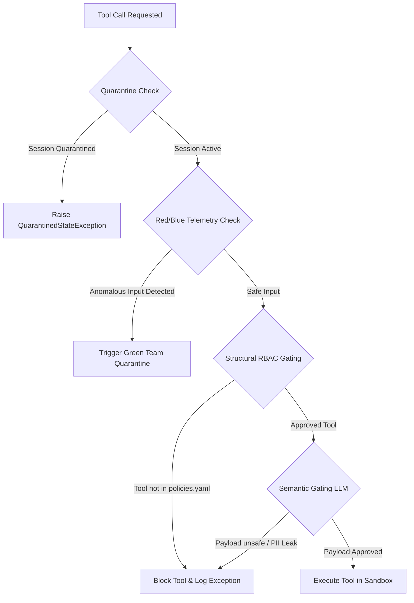

# VibeReview: Architect Review & Q&A Guide

Welcome to the comprehensive technical guide for **VibeReview**—a self-defending, graph-native continuous code auditor. This document serves as a complete briefing for managers, security teams, and system architects.

---

## 1. Executive Summary & Value Proposition

VibeReview is a production-ready, continuous code auditor built on the **Google Agent Development Kit (ADK)**. Traditional auditing tools (SAST/DAST) flag vulnerabilities but suffer from high false-positive rates and cannot autonomously patch code. Monolithic AI tools can write patches but are vulnerable to prompt injections, command execution exploits, and context dilution.

VibeReview bridges this gap under a **Zero-Trust Security Architecture**:
* **Graph-Native Context:** Leverages a Spanner Graph Model Context Protocol (MCP) gateway to query dependencies and call graphs structurally, avoiding context bloat.
* **Orchestrator Workflow:** Partitions reasoning across five sequential sub-agents to optimize model focus and API token utilization.
* **Active Defense (RBG Teaming):** Protects the agent runtime with active injection testing (Red Team), telemetry anomaly detection (Blue Team), and stateful quarantine (Green Team).
* **Decoupled UI (A2UI):** Enforces strict separation between raw security outputs and visual layouts via declarative A2UI templates to isolate browser presentation boundaries.

---

## 2. System Architecture & Workflows

VibeReview separates security orchestration, tool gating, and presentation layout:

### A. Sequential Agent Pipeline
VibeReview maps the auditing lifecycle across five sequential ADK workflow nodes:

1. **Search Agent:** Clones the repository locally using `clone_github_repo` and runs automated Checkmarx-style SAST/SCA and SonarQube-style Code Smell audits using `query_spanner_graph`.
2. **Story Agent:** Fetches requirements, specifications, and issue tickets using `get_epic_details` to verify functional compliance.
3. **Impact Agent:** Traces dependency graphs and evaluates call structures using `get_impact_tool` to map downstream side-effects.
4. **Task-Breakdown Agent:** Partitions the security patch work into atomic, ordered tickets using `create_work_tickets`.
5. **Coding Agent:** Generates code refactoring edits, writes unit tests, and validates modifications inside a secure sandbox using `execute_sandbox`.

### B. Security Interceptor & Gating Pipeline
Every tool call initiated by any sub-agent must pass through the Hybrid Policy Server:

---

## 3. Core Capabilities & Scanning Heuristics

### Static Application Security Testing (SAST)
The search agent scans source files matching Checkmarx standards:
* **SQL Injection:** Detects unparameterized variables or string concatenation inside database execute scripts.
* **Command Injection:** Detects unvalidated subprocess shell executions (`shell=True`) and direct shell execution calls (`os.system`).
* **Insecure Cryptography:** Identifies weak cryptographic hashing algorithms like MD5 or SHA1.
* **Path Traversal:** Detects concatenated variables passed directly into file opens or paths.
* **Cross-Site Scripting (XSS):** Flags innerHTML injections or unescaped HTTP inputs.

### Software Composition Analysis (SCA)
Scans dependency config files (`pyproject.toml`, `requirements.txt`) for version pins and flags outdated or vulnerable packages (e.g. outdated `pyjwt` or `requests` versions).

### SonarQube Code Smells & Technical Debt
Identifies code readability and quality issues:
* Empty try/except blocks (`except: pass`).
* Broad exception catches (`except Exception:`).
* Leftover `TODO` or `FIXME` comments in production code.
* Hardcoded api keys, secrets, or tokens.

---

## 4. Architect Q&A (Prepared Questions & Answers)

### Q1: How does the system protect against prompt injection (adversarial comments in files)?
* **Answer:** VibeReview implements a multi-layered guardrail. 
  1. **Telemetry Checking (Blue Team):** Scan variables for command injection signatures (like `rm -rf`).
  2. **Structural Gating (RBAC):** Restricts what tools each agent can run (defined in `policies.yaml`). A search agent cannot run shell commands, preventing it from being manipulated.
  3. **Semantic Gating:** A secondary, isolated LLM firewall reviews argument payloads before they are executed.
  4. **gVisor Sandboxing:** Even if an exploit bypasses gating, the code runs inside an ephemeral, network-isolated container.

### Q2: Why partition the system into 5 agents instead of using one monolithic agent?
* **Answer:** Context dilution is a major failure vector for large codebases. Monolithic agents lose focus when fed hundreds of lines of code, requirements, and call graphs. By breaking the pipeline into distinct stages (Search ➔ Story ➔ Impact ➔ Tasks ➔ Coding):
  * We isolate tool permissions per stage (minimizing blast radius).
  * We reduce token context sizes, decreasing costs and latencies.
  * We establish checkpoint validation states between stages.

### Q3: What is A2UI and why do we use it?
* **Answer:** A2UI (Agent-to-User Interface) separates backend database logic from frontend layout presentation. If an agent generates raw HTML or javascript to present findings, it introduces severe Cross-Site Scripting (XSS) and command injection vulnerabilities. 
  * Under A2UI, the agent writes a declarative JSON payload ("sheet music") referencing pre-approved catalog components (such as Cards, Lists, and Buttons). 
  * The frontend client parses this secure JSON to construct the UI, ensuring no raw HTML or script is ever executed in the browser.

### Q4: How does the system handle credentials and mask PII?
* **Answer:** VibeReview utilizes a bidirectional `ContextResolver` preprocessor:
  * **Masking:** Before sending text to Google GenAI inference, a regex engine replaces emails, IP addresses, and API credentials with placeholder tokens (e.g. `[[API_KEY_1]]`).
  * **Unmasking:** After the agent completes its reasoning, a local unmasking gateway restores the original values, ensuring that no sensitive secrets ever touch external prompt logging backends.

### Q5: Can the scanning engine run fully offline?
* **Answer:** Yes. The SAST, SCA, and Code Smell scanning rules are implemented as local Python regex engines that run fully offline on the host machine. The unit test suite (`pytest tests/unit`) runs fully offline without needing Google Cloud Vertex AI credentials. The Vertex AI/GenAI services are only invoked for agent reasoning and semantic firewall checks.

### Q6: How do we scale this for larger enterprise codebases?
* **Answer:** For large systems, VibeReview scales via:
  1. **Spanner Graph MCP:** Spanner Graph GQL queries and vector indices allow the agent to fetch only the relevant code call trees instead of loading the entire codebase into memory.
  2. **Pre-Auditing Filters:** Git diff hooks trigger the pipeline only on files modified in pull requests rather than scanning the entire codebase on every run.
