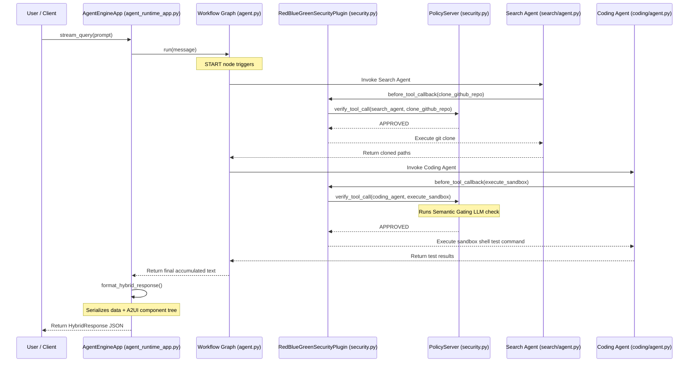

# VibeReview: Architectural Code Flow Guide

This document provides a detailed, function-level code execution flow for **VibeReview**. It traces the path of execution from the moment a user inputs a prompt in the playground or stand-alone script to the final aggregation and rendering of the output, illustrating the interaction between the ADK framework, security plugins, and tools.

---

## 1. High-Level Flow Sequence

The diagram below maps the execution sequence across the system components:

---

## 2. Step-by-Step Function & Script Flow

### Step 1: Input Ingestion & Ingestion Entrypoint
*   **Trigger:** The developer invokes the standalone runner or playground.
*   **Active Script:** `run_standalone.py` or `run_canvas_ui.py` or `.venv/bin/agents-cli playground`
*   **Execution Flow:**
    1.  `run_standalone.py` loads environment variables via `load_dotenv()`.
    2.  Invokes `agent_runtime.stream_query(message=prompt, user_id="...")` (imported from [app/agent_runtime_app.py](file:///Users/sougataroy/Downloads/Kaggle%20Antigravity/Capstone%20Project/vibe-review/app/agent_runtime_app.py)).

---

### Step 2: ADK Setup & Workflow Dispatch
*   **Active Script:** [app/agent_runtime_app.py](file:///Users/sougataroy/Downloads/Kaggle%20Antigravity/Capstone%20Project/vibe-review/app/agent_runtime_app.py)
*   **Class/Function:** `AgentEngineApp` (inherits from `AdkApp`)
*   **Execution Flow:**
    1.  `set_up(self)`: Runs on initialization. Calls `vertexai.init()` and triggers `setup_telemetry()` from `app/app_utils/telemetry.py`.
    2.  `stream_query(self, message, user_id, ...)`: Receives the user prompt and forwards it to the underlying workflow orchestrator registered on the app: `adk_app` (defined in [app/agent.py](file:///Users/sougataroy/Downloads/Kaggle%20Antigravity/Capstone%20Project/vibe-review/app/agent.py)).

---

### Step 3: Workflow Graph Initialization
*   **Active Script:** [app/agent.py](file:///Users/sougataroy/Downloads/Kaggle%20Antigravity/Capstone%20Project/vibe-review/app/agent.py)
*   **Class/Function:** `Workflow` orchestrator
*   **Execution Flow:**
    1.  `create_root_agent()`: Instantiates the 5 sub-agents and maps sequential execution paths:
        *   `START ➔ search_agent ➔ story_agent ➔ impact_agent ➔ task_breakdown_agent ➔ coding_agent`
    2.  The orchestrator begins driving the session state starting at the `search_agent` node.

---

### Step 4: Search Node Execution & Tool Gating Interceptor
*   **Active Script:** [app/sub_agents/search/agent.py](file:///Users/sougataroy/Downloads/Kaggle%20Antigravity/Capstone%20Project/vibe-review/app/sub_agents/search/agent.py)
*   **Class/Function:** `search_agent` node
*   **Execution Flow:**
    1.  The agent resolves that it needs to retrieve a repository and scan it. It triggers a tool call to `clone_github_repo` or `query_spanner_graph`.
    2.  **Tool Call Interception:** Before execution, `RedBlueGreenSecurityPlugin.before_tool_callback` in [app/security.py](file:///Users/sougataroy/Downloads/Kaggle%20Antigravity/Capstone%20Project/vibe-review/app/security.py) intercepts the call:
        *   **Quarantine Gating:** Asserts if session state `agent_status` is `QUARANTINED`. If true, raises `QuarantinedStateException`.
        *   **Blue Team Anomaly Detection:** Scans the arguments list. If a signature (like `rm -rf` or `adversarial_vibes`) is found, transitions state `agent_status` to `QUARANTINED` and raises a `SecurityAnomalyException`.
        *   **Structural Gating:** Calls `PolicyServer.check_structural_gating("search_agent", "clone_github_repo")`. It reads `app/policies.yaml` to ensure the tool name is in the allowed list for the search agent.
        *   **Semantic Gating:** (Only for write/execute tools) Sends payload arguments to a secondary Gemini instance to evaluate safety intent before permitting.
    3.  **Tool Execution:**
        *   `clone_github_repo(repo_url, local_path)` executes `git clone <repo_url> <local_path>` via a python subprocess.
        *   `query_spanner_graph(query, search_path)` recursively walks the directory, running regex scanners checking for Checkmarx SAST vulnerabilities (injection, weak crypto), Checkmarx SCA package rules (outdated library versions), and SonarQube Code Smells.
    4.  Search findings are aggregated into the workflow execution trajectory, and control passes to the `story_agent`.

---

### Step 5: Intermediate Handoffs (Story, Impact, Tasks)
*   **Active Scripts:**
    *   [app/sub_agents/story/agent.py](file:///Users/sougataroy/Downloads/Kaggle%20Antigravity/Capstone%20Project/vibe-review/app/sub_agents/story/agent.py)
    *   [app/sub_agents/impact/agent.py](file:///Users/sougataroy/Downloads/Kaggle%20Antigravity/Capstone%20Project/vibe-review/app/sub_agents/impact/agent.py)
    *   [app/sub_agents/task_breakdown/agent.py](file:///Users/sougataroy/Downloads/Kaggle%20Antigravity/Capstone%20Project/vibe-review/app/sub_agents/task_breakdown/agent.py)
*   **Execution Flow:**
    1.  `story_agent` calls `get_epic_details(epic_id)` to verify requirement compliance.
    2.  `impact_agent` calls `get_impact_tool(target)` to map downstream side-effects.
    3.  `task_breakdown_agent` calls `create_work_tickets(tasks)` to structure atomic changes.
    4.  Each node tool call is intercepted and gated by [app/security.py](file:///Users/sougataroy/Downloads/Kaggle%20Antigravity/Capstone%20Project/vibe-review/app/security.py). Trajectories are preserved and passed downstream.

---

### Step 6: Sandbox Execution & Patches Verification
*   **Active Script:** [app/sub_agents/coding/agent.py](file:///Users/sougataroy/Downloads/Kaggle%20Antigravity/Capstone%20Project/vibe-review/app/sub_agents/coding/agent.py)
*   **Class/Function:** `coding_agent` node
*   **Execution Flow:**
    1.  The coding agent writes security fixes and constructs verification tests.
    2.  Triggers a tool call to `execute_sandbox(command)`.
    3.  **Gating Interceptor:** Intercepted by `before_tool_callback`. Since `execute_sandbox` is a command execution tool, `PolicyServer` executes **Semantic Gating** via an LLM call to verify that the CLI command is safe and does not contain malicious code or payload bypasses.
    4.  **Sandbox Execution:** runs `subprocess.run(command, shell=True, capture_output=True, text=True, timeout=30)` locally, returning stdout/stderr back to the agent.
    5.  The Coding Agent validates if tests passed, builds the visual presentation JSON, and ends the workflow pipeline execution.

---

### Step 7: Post-Processing & Presentation Serialization
*   **Active Script:** [app/agent_runtime_app.py](file:///Users/sougataroy/Downloads/Kaggle%20Antigravity/Capstone%20Project/vibe-review/app/agent_runtime_app.py)
*   **Class/Function:** `AgentEngineApp.stream_query` (post-workflow generator block)
*   **Execution Flow:**
    1.  Captures the accumulated text response emitted by the multi-agent workflow.
    2.  Invokes `format_hybrid_response(accumulated_text)`:
        *   **Heuristics Matcher:** Scans the text for vulnerability signatures (user enumeration, weak hashing, JWT, SAST vulnerabilities, SCA dependency warnings, and SonarQube code smells).
        *   **Envelope Building:** Serializes findings into `data` metrics and builds the declarative A2UI visual components catalog tree (`ui`) with Cards, Lists, and Buttons.
        *   **Instantiation:** Packs the details into a validated `HybridResponse` Pydantic model.
    3.  Yields the serialized JSON envelope to the client.

---

### Step 8: Client-Side Rendering
*   **Execution Flow:**
    *   **CI/CD Headless Client (`run_standalone.py`):** Reads the `data` payload metrics, ignores the layout information, prints diagnostic reports to the terminal, and writes `pr_security_report.md` for posting as a GitHub comment.
    *   **Simulated Canvas UI (`run_canvas_ui.py`):** Ignores the `data` metrics, extracts the visual components catalog tree, traverses the elements recursively, and prints a visual console mockup of the dashboard layout components.
