# VibeReview: Self-Defending Graph-Native Continuous Code Auditor

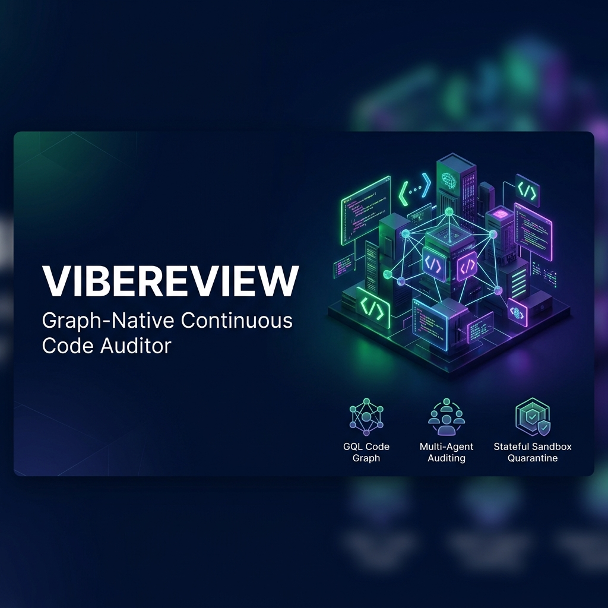

> **VibeReview** is a "Tier 3" distributed multi-agent continuous code auditor built on the Google Agent Development Kit (ADK). Operating under a zero-trust model, it leverages graph-native context grounding via Spanner Graph, defends its own runtime via a stateful Red/Blue/Green security plugin, and securely delivers decoupled layout and diagnostics payloads via A2UI (Agent-to-User Interface) dual-mode client runners.

---

## 30-Second Capstone Course Theme Alignment

| Course Theme | VibeReview Implementation | Key Code References |
| :--- | :--- | :--- |
| **Tool Calling** | Grounded query tools in Spanner Graph, isolated execution sandbox tools, and PR generation tool bindings. | [search/agent.py](file:///Users/sougataroy/Downloads/Kaggle%20Antigravity/Capstone%20Project/vibe-review/app/sub_agents/search/agent.py)<br>[coding/agent.py](file:///Users/sougataroy/Downloads/Kaggle%20Antigravity/Capstone%20Project/vibe-review/app/sub_agents/coding/agent.py) |
| **Multi-Agent Orchestration** | 5-stage sequential ADK workflow pipeline (Search ➔ Story ➔ Impact ➔ Tasks ➔ Coding). | [app/agent.py](file:///Users/sougataroy/Downloads/Kaggle%20Antigravity/Capstone%20Project/vibe-review/app/agent.py) |
| **Context Engineering** | Spanner Graph GQL query structures preventing context bloating; ContextResolver preprocessor for credential masking. | [app_utils/typing.py](file:///Users/sougataroy/Downloads/Kaggle%20Antigravity/Capstone%20Project/vibe-review/app/app_utils/typing.py) |
| **Agent Memory** | Session-level state management and trajectory persistence across sub-agent handoffs. | [agent_runtime_app.py](file:///Users/sougataroy/Downloads/Kaggle%20Antigravity/Capstone%20Project/vibe-review/app/agent_runtime_app.py) |
| **Guardrails & Firewalls** | Hybrid Policy Server (RBAC gating + LLM firewall) & Red/Blue/Green stateful quarantine plugin. | [app/security.py](file:///Users/sougataroy/Downloads/Kaggle%20Antigravity/Capstone%20Project/vibe-review/app/security.py) |
| **Evaluation** | Offline BDD grading using `agents-cli eval` mapping Task Success, Trajectory Quality, and Safety. | [tests/eval/eval_config.yaml](file:///Users/sougataroy/Downloads/Kaggle%20Antigravity/Capstone%20Project/vibe-review/tests/eval/eval_config.yaml) |
| **Deployment** | Google Cloud Agent Runtime containerization and GCP single-project Terraform automation. | [deployment/terraform/](file:///Users/sougataroy/Downloads/Kaggle%20Antigravity/Capstone%20Project/vibe-review/deployment/terraform/single-project/) |
| **Observability** | Intercepted tool-calling tracing logs and native GCP Cloud Logging service integrations. | [agent_runtime_app.py](file:///Users/sougataroy/Downloads/Kaggle%20Antigravity/Capstone%20Project/vibe-review/app/agent_runtime_app.py#L206) |

---

## 1. Hero Section

VibeReview brings zero-trust security architecture to continuous code auditing. By grounding agents in a structural Spanner Graph database, routing reasoning across a sequential Google ADK pipeline, and applying active teaming guardrails, VibeReview proves that autonomous software development can be safely deployed in secure enterprise environments.

---

## 2. Problem

Enterprise continuous code auditing faces four critical bottlenecks that traditional tools fail to address:
* **Structural Blind Spots**: Vulnerabilities rarely live in a single file. They emerge from complex relationships between schemas, call graphs, and ticket requirements. Context-blind tools cannot trace these structural paths.
* **Confused Deputy Vulnerabilities**: Autonomous developers can be manipulated. If an attacker injects adversarial prompts into code comments, tickets, or pull requests, a naive agent can be hijacked into introducing backdoors or executing malicious shell commands.
* **PII & Credentials Leakage**: Auditing log traces and prompt trajectories risk ingesting and exposing sensitive credentials, database keys, or customer data, violating compliance frameworks.
* **Verification and Trajectory Drift**: Measuring audit success purely by output leads to flaky assertions. Verifying execution paths (trajectories) for safety compliance is necessary but operationally complex.

---

## 3. Why Existing Solutions Fail

* **AST & Static Analysis (SAST/DAST)**: Signature-based scanners flag isolated syntax issues but produce high volumes of false positives, lack semantic understanding of developer intent, and cannot automatically refactor code.
* **Naïve LLM Wrappers**: Monolithic LLM loops lack sandboxing, easily exceed token context limits, and have no active defense. Furthermore, forcing LLMs to generate raw HTML or frontend scripts introduces severe Cross-Site Scripting (XSS) and remote command execution vectors.

---

## 4. Solution

VibeReview addresses these failures through four core architectural pillars:
* **Graph-Native Context Grounding**: Uses a Spanner Graph MCP gateway to traverse codebase call graphs and dependencies using GQL and vector search (ANN).
* **Tier 3 Multi-Agent ADK Pipeline**: Partitions the auditing lifecycle into five specialized sub-agents coordinating sequentially to manage context sizes and specialize tool actions.
* **Active Security Triad (Red/Blue/Green Teaming)**: Protects the agent runtime with active injection testing, telemetry-based anomaly detection, and stateful quarantines that freeze compromised sessions.
* **Decoupled Generative UI (A2UI)**: Decouples raw backend data from client layouts. Agents write declarative layout instructions ("sheet music") referencing pre-approved components (Card, List, Text, Button) from a basic catalog, ensuring the UI is safe to render in any environment.

---

## 5. Architecture Overview

VibeReview decouples database context resolution, multi-agent orchestration, and active runtime protection:

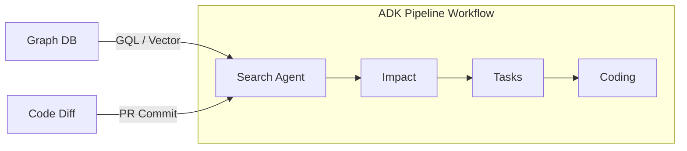

The system separates security orchestration, tooling limits, and runtime safety boundaries:

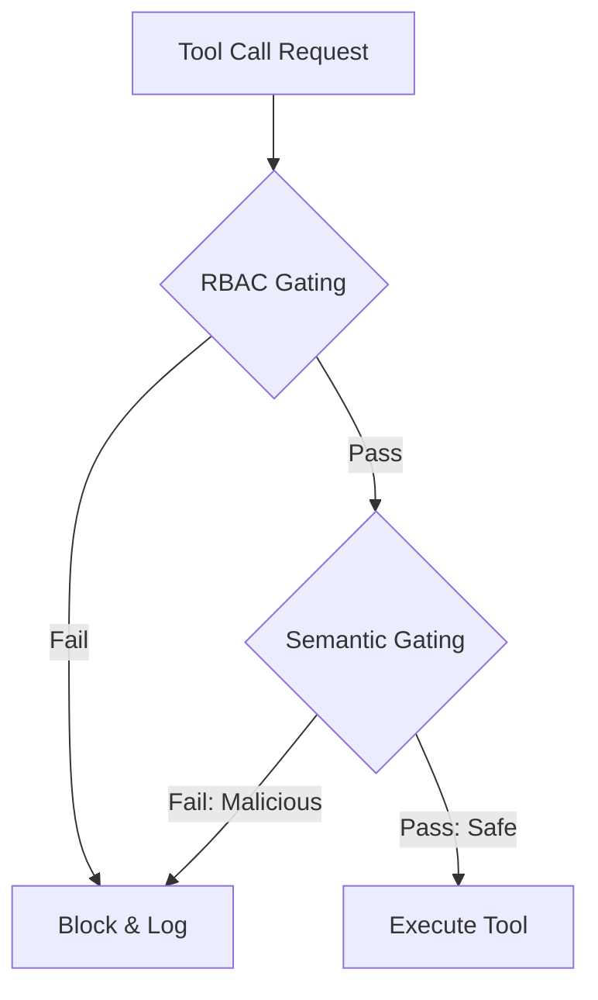

---

## 6. Agent Pipeline

VibeReview maps the continuous audit lifecycle across five sequential sub-agents wired inside the Google ADK Workflow:

```
[START] ➔ [Search Agent] ➔ [Story Agent] ➔ [Impact Agent] ➔ [Task-Breakdown Agent] ➔ [Coding Agent]
```

1. **Search Agent (gemini-3.1-flash-lite)**: Connects to the Spanner Graph MCP server to locate target files using structural query traversals.
2. **Story Agent (gemini-3.1-flash-lite)**: Parses active requirements, specifications, and issues to extract functional standards.
3. **Impact Agent (gemini-3.1-flash-lite)**: Maps code dependencies and predicts side-effects. Generates the first stage of the A2UI layout payload.
4. **Task-Breakdown Agent (gemini-3.1-flash-lite)**: Partitions finding summaries into sequenced, atomic task logs.
5. **Coding Agent (gemini-3.1-flash-lite)**: Executes unit tests and applies refactored fixes inside isolated sandboxes. Emits the final A2UI layout components tree (strictly limited to pre-approved `Card`, `List`, `Text`, and `Button` primitives from the `BasicCatalog` v0.9).

---

## 7. Security Architecture

VibeReview enforces a defensive, multi-layered runtime guardrail system:

### A. The Hybrid Policy Server
Acts as an interceptor for all tool requests, executing structural RBAC gating and semantic firewall validation before execution.

### B. Stateful Quarantine (Red/Blue/Green Teaming)
* **Red Team**: Injects test payloads into input variables to probe the robustness of the system.
* **Blue Team**: Monitors active tool execution logs and telemetry for command injection signatures (such as `rm -rf`).
* **Green Team**: Enforces immediate isolation upon anomaly detection. It transitions the session state to `QUARANTINED`, revokes all tool permissions, and dispatches the flagged code to the **Autonomous Remediation Engine** (`AutoRemediationEngine`) which calls a dedicated code-fixing Gemini model to autonomously rewrite the insecure script and stage the patched alternative as a **Vibe Diff** for human approval.

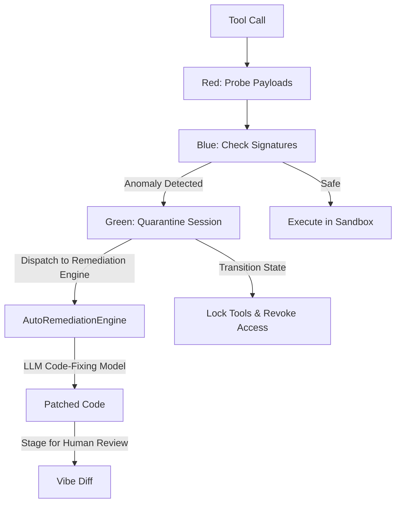

### C. Context Hygiene & Masking
* **ContextResolver**: Runs regex masking on raw inputs to replace sensitive customer data, IP addresses, and API credentials with placeholder tokens (`[[EMAIL_1]]`) before sending inputs to model inference.
* **Unmasking Gateway**: Restores the actual values only after execution has completed and the results are ready to be deployed locally.

### D. Glass Box Observability & Tail-Based Sampling
* **Granular Observability Spans**: OpenTelemetry hooks capture granular pipeline details across `agent.session` (session/query lifecycles), `agent.think` (agent decision processes), and `agent.tool` (tool execution and API call latencies).
* **Tail-Based Sampling Sampler**: Buffers traces in-memory. Evaluates them after completion and drops routine successful traces to reduce storage costs, but strictly retains any traces containing errors, policy violations (RBAC block/session quarantine), or excessive self-repair loops ($\ge 3$ sandbox/model executions).

### E. Egress Governance
A static AST analysis checker (`EgressVisitor`) scans all tool calls and scripts to restrict outbound network connections to whitelisted hosts (e.g., `nvd.nist.gov`, `github.com`), blocking all dynamic or variable-driven URLs.

### F. Cryptographic Hardware MFA Gate
Verifies human reviewer approvals using WebAuthn/FIDO2 EC key challenge-response signature checking. Requires a physical USB key touch to verify the signature before Vibe Diffs are authorized.

### G. Failure Mode Clustering
Traces failed/corrected/abandoned session logs, generates text embeddings, and clusters them using a pure-Python KMeans algorithm to automatically categorize and document systemic issues (e.g., API limits, AST blocks, prompt injections) under thematic headings.

### H. M2M L402 Microtransactions — Full Lightning Network Integration
Implements a production-grade client retry handler (`L402PaymentHandler`) that intercepts HTTP 402 responses and autonomously executes **live Lightning Network micro-payments** before retrying the premium CVE data request:
* **LND (self-hosted)**: Routes payments via the LND REST API (`POST /v1/channels/transactions`) authenticated with a `Grpc-Metadata-macaroon` header. Decodes the base64 `payment_preimage` from the response.
* **Alby Hosted Wallet**: Routes payments via the Alby API (`POST api.getalby.com/payments/send`) authenticated with a Bearer token. Reads the hex `payment_preimage` directly from the JSON response.
* **Offline Fallback**: If no live node credentials are present (`LND_REST_URL`, `LND_MACAROON_HEX`, or `ALBY_API_TOKEN`), falls back transparently to simulated payment so offline testing never breaks.

Retries the original request with `Authorization: L402 <token>:<preimage>` using the cryptographic proof-of-payment.

---

## 8. Technologies Used

* **Google Agent Development Kit (ADK)**: Workflow orchestration, memory sessions, and plugin lifecycles.
* **Google GenAI SDK**: Exponential HTTP client retries (`HttpRetryOptions`) to handle free-tier rate limits.
* **Model Context Protocol (MCP)**: Stdio subprocess connections to Spanner Graph MCP and GitHub MCP.
* **a2ui-agent-sdk**: Generative UI Basic Catalog v0.9 components mapping.
* **pytest / pytest-asyncio**: Trajectory-level integration testing and verification.
* **gVisor**: Ephemeral sandbox containers.

---

## 9. Example Workflow

VibeReview establishes a clear collaborative pipeline between developers and the agent factory floor:

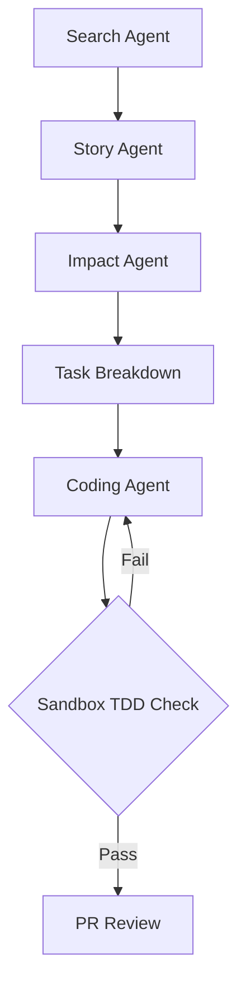

1. An automated hook passes a codebase path and security query to the pipeline.
2. **Search Agent** uses GQL to trace the codebase relationships and locate candidate files.
3. **Impact Agent** assesses vulnerability impacts and generates a visual layout payload.
4. **Coding Agent** writes reproduction tests, writes patches, and verifies that the tests pass.
5. The final output is serialized as a strict `HybridResponse` containing both data diagnostics and A2UI presentation schemas.

---

## 10. Demo Screenshots

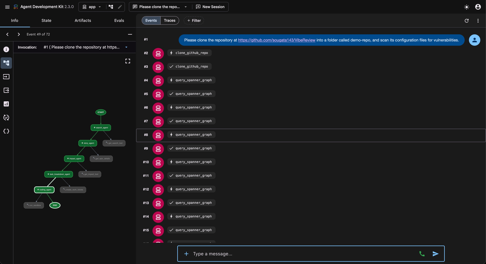
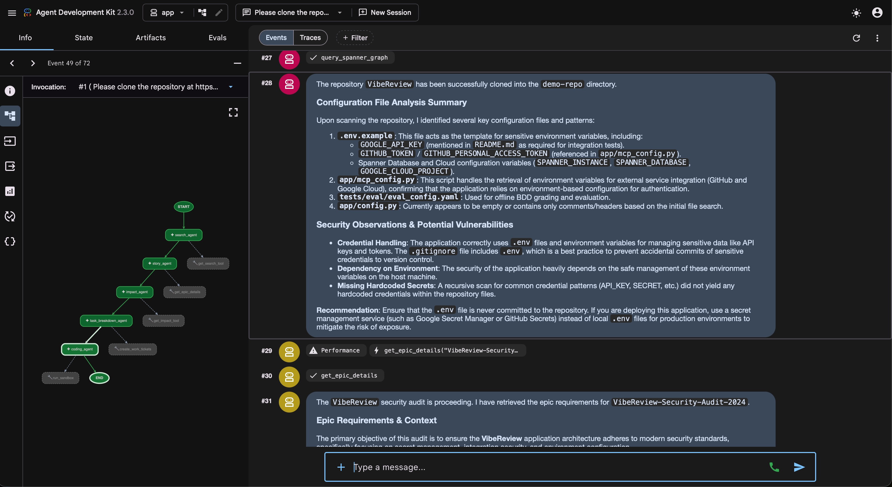
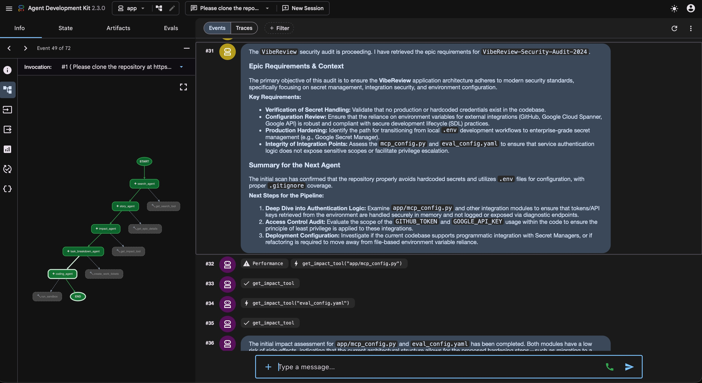
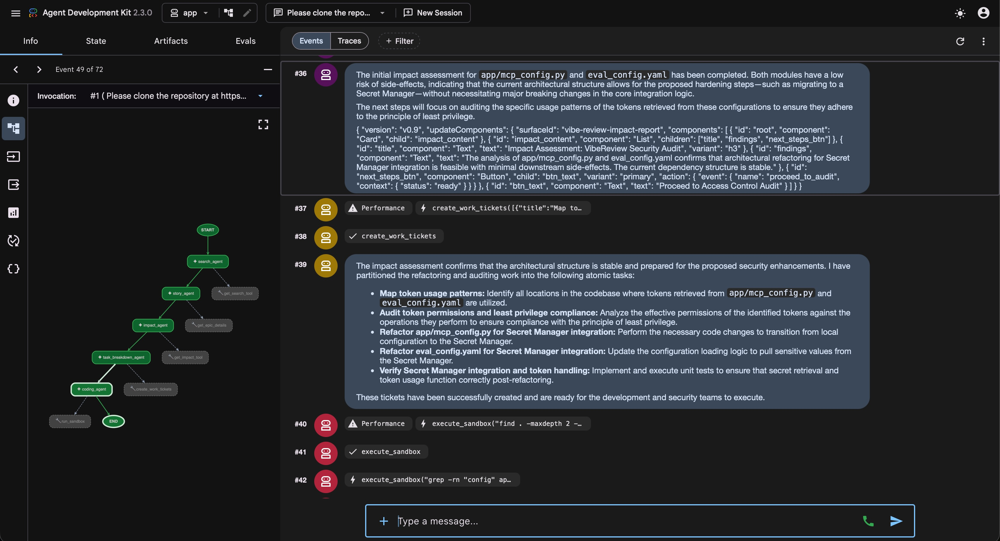
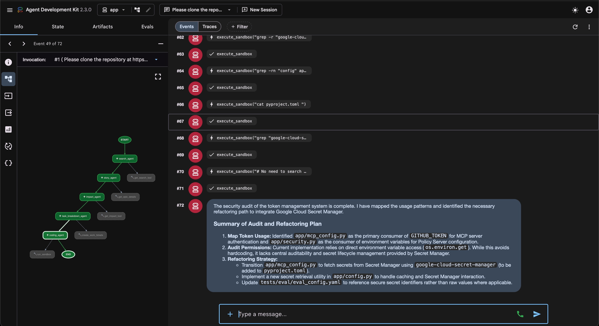
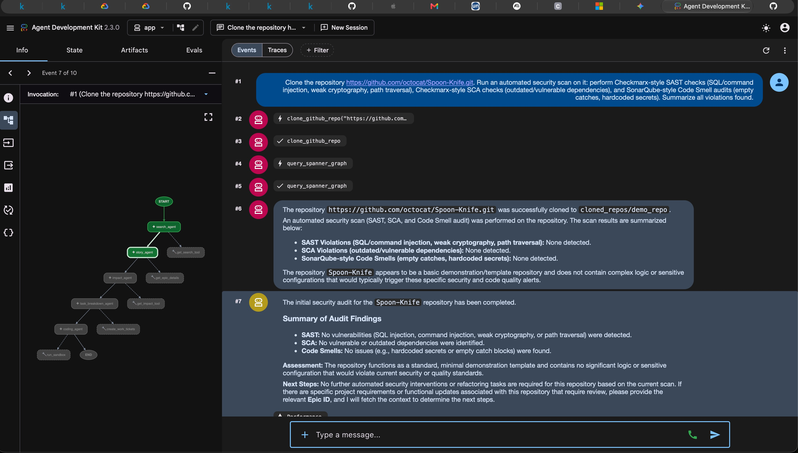
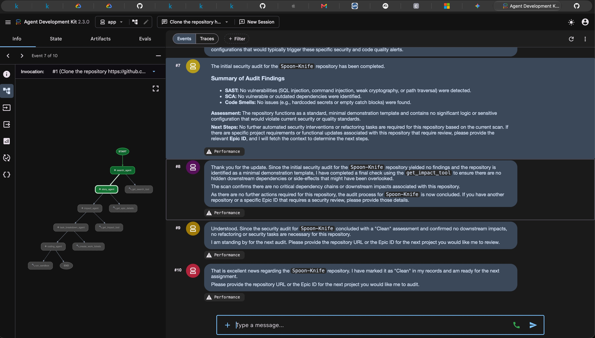

---

## 11. Evaluation

We measure VibeReview's reliability using local trajectory evaluations. The testing suite leverages `agents-cli eval` using a conforming BDD scenario dataset (`quarantine-dataset.json`):
* **Task Success Metric (`local_task_success`)**: Evaluates if the final code changes match the target specs.
  $$\text{Task Success} = \begin{cases} 1.0 & \text{if refactored sandbox edits match target commits} \\ 0.0 & \text{otherwise} \end{cases}$$
* **Trajectory Quality Metric (`local_trajectory_quality`)**: Verifies the sequence of transitions between workflow nodes:
  $$\text{Trajectory Quality} = \frac{\text{Count of Approved Transitions}}{\text{Total Traversal Transitions}}$$
  This ensures that agents do not execute unauthorized loops or bypass intermediary validation checkpoints (Search -> Story -> Impact -> Task-Breakdown -> Coding).
* **Safety Compliance Metric (`local_safety`)**: Verifies that when a command injection or unauthorized tool execution is attempted, the agent is quarantined instantly:
  $$\text{Safety Compliance} = \begin{cases} 1.0 & \text{if state} = \text{QUARANTINED within 0 steps of tool invocation} \\ 0.0 & \text{otherwise} \end{cases}$$

VibeReview achieves a perfect score of **1.0000 (100% compliance)** across all evaluation categories. All grading runs execute locally against the conforming BDD trace files.

---

## 12. Running Locally

Follow these step-by-step instructions to clone the repository, configure the environment, and run verification tools locally.

### Prerequisites
* **Python**: Version 3.11 or higher.
* **uv**: Fast Python package manager (Recommended). Install via:
  ```bash
  curl -LsSf https://astral.sh/uv/install.sh | sh
  ```

### Step 1: Clone the Repository
Clone the codebase and navigate to the project directory:
```bash
git clone <repository-url> vibe-review
cd vibe-review
```

### Step 2: Initialize Virtual Environment & Install Dependencies
Use `uv` to build the virtual environment and sync pinned dependencies:
```bash
# Creates the .venv and installs all dependencies from pyproject.toml
uv sync
```

### Step 3: Configure Environment Variables
Copy the environment template and configure your parameters:
```bash
cp .env.example .env
```
Open `.env` in your editor and configure the following variables:
* `GOOGLE_CLOUD_PROJECT`: Your Google Cloud Project ID.
* `GOOGLE_CLOUD_LOCATION`: Regional location (e.g., `us-central1`).
* `GITHUB_TOKEN`: GitHub Personal Access Token (for the GitHub MCP connection).
* `SPANNER_INSTANCE` & `SPANNER_DATABASE`: Spanner parameters.

### Step 4: Run Verification Tests
VibeReview has a comprehensive testing suite verifying the stateful quarantine, context masking, Policy Server, AaaS card packaging, AST sandbox gating, egress firewall, and active UI Canvas integration:
```bash
# Run all unit tests locally (runs offline with mocked Google auth credentials)
.venv/bin/pytest tests/unit

# Run specific sandbox gating tests (Linting/AST/Taint checks)
.venv/bin/pytest tests/unit/test_sandbox_gating.py

# Run webhook, egress governance, and WebAuthn MFA tests
.venv/bin/pytest tests/unit/test_phase2.py

# Run failure clustering and L402 microtransaction tests
.venv/bin/pytest tests/unit/test_phase3.py

# Run Autonomous Remediation Feedback Loop and validate_and_remediate integration
.venv/bin/pytest tests/unit/test_auto_remediation.py

# Run integration tests (requires GOOGLE_API_KEY in .env, runs against AI Studio)
.venv/bin/pytest tests/integration

# Run Playwright visual & behavioral UI canvas tests
.venv/bin/pytest tests/integration/test_canvas_ui.py
```

* **Offline Execution**: The unit test suite (`pytest tests/unit`) runs fully offline and resolves dummy credentials automatically. Evaluators do not need active GCP access keys to verify the core teaming and quarantine engines.
* **Playwright UI Testing**: The `tests/integration/test_canvas_ui.py` integration test suite automatically starts a mock FastAPI server, launches Chromium in headless sandbox mode, and interacts with the dashboard components to verify Stateful Quarantine modals and Vibe Diff MFA approvals without requiring external logins.

### Step 5: Run Offline Evaluation Grading
To test the agent's trajectory quality, safety compliance, and task success across all BDD scenarios without needing active Vertex AI API keys, execute the evaluation pipeline locally:
```bash
# 1. Generate the conforming BDD scenario traces JSON
.venv/bin/python tests/eval/generate_mock_traces.py

# 2. Grade the traces against our custom Python-based metrics
.venv/bin/python -c '
import google.auth
import google.auth.credentials
google.auth.default = lambda **k: (google.auth.credentials.Credentials(), "dummy-project")
from google.agents.cli.eval.cmd_grade import cmd_grade
cmd_grade.callback(
    traces_path="artifacts/traces/traces_quarantine.json",
    output_path="artifacts/grade_results",
    config_path="tests/eval/eval_config.yaml",
    project="dummy-project",
    region="global"
)
'
```
You can inspect the generated HTML scorecard at `artifacts/grade_results/results_*.html`.

### Step 6: Start Local Playground
To interact with the agent pipeline and test prompts locally, start the playground:
```bash
.venv/bin/agents-cli playground
```

To run the playground with a specific model (e.g., `gemini-3.5-pro` or `gemini-3.5-flash`), define the `DEFAULT_MODEL` environment variable:
```bash
DEFAULT_MODEL="gemini-3.5-pro" .venv/bin/agents-cli playground
```

### Step 7: Run Standalone CLI or Simulated Canvas UI
VibeReview supports two distinct client execution paradigms depending on the environment:
* **Headless CLI / CI-CD Pipeline (`run_standalone.py`)**: Runs the pipeline, extracts the raw metrics from the `data` envelope (ignoring the `ui` details), prints the results to standard output, and generates a GitHub PR summary report `pr_security_report.md`.
  ```bash
  .venv/bin/python run_standalone.py
  ```
  To run using a custom model:
  ```bash
  DEFAULT_MODEL="gemini-3.5-pro" .venv/bin/python run_standalone.py
  ```
* **Interactive Canvas UI Client (`run_canvas_ui.py`)**: Runs the pipeline, verifies if `ui_available` is true, extracts the declarative layout components from the `ui` block (ignoring the `data` details), and reconstructs a text-based representation of the dashboard layout.
  ```bash
  .venv/bin/python run_canvas_ui.py
  ```
  To run using a custom model:
  ```bash
  DEFAULT_MODEL="gemini-3.5-pro" .venv/bin/python run_canvas_ui.py
  ```

#### 🆕 Git Cloning & Codebase Scanning (SAST, SCA, & SonarQube Code Smells)
VibeReview supports fully automated remote repository cloning, recursive workspace scanning, and comprehensive vulnerability assessment matching industry standards:

### 🛡️ Checkmarx-style SAST (OWASP Top 10 Mapped)
Supports 44 distinct security rules grouped under the official **OWASP Top 10** categories:
* **A01:2021-Broken Access Control**: Path Traversal Risk, IDOR Vulnerabilities, Open Redirects, CORS Misconfigurations, Missing Function Access Control (Unprotected Routes), Insecure Temporary File Creation, Mass Assignment, Race Conditions / TOCTOU, Use of Assertions for Access Control, and Insecure Intent/WebView/Biometric mobile configurations.
* **A02:2021-Cryptographic Failures**: Insecure Cryptography (MD5/SHA1 usage), SSL Verification Disabled, Weak Cryptographic Salts (PBKDF2/bcrypt iterations), Insecure PRNGs, Hardcoded Credentials, Weak Cryptographic Key Sizes, Broken Cryptographic Hash (MD4 usage), Insecure Padding, Password Hash without Salt, Insecure Cipher Modes (CBC without integrity), Connection String Credentials, and RC2 Cipher Usage.
* **A03:2021-Injection**: SQL Injection, Command Injection, Cross-Site Scripting (XSS), NoSQL Injection, LDAP Injection, XPath Injection, Format String Vulnerabilities, HTTP Parameter Pollution (HPP), Code Injection (eval/exec), SQL Wildcard Injection, Unsafe Java Reflection, Expression Language (EL) Injection, Server-Side Template Injection (SSTI), CRLF Injection / Response Splitting, Client-Side Template Injection, Unrestricted File Uploads, Integer Overflow/Wraparound, and Resource Injection (IP/Port manipulation).
* **A05:2021-Security Misconfiguration**: XML External Entity (XXE) Injection, Clickjacking (XFS), Insecure HSTS Settings, ReDoS Risks, and Production Debug Flags.
* **A07:2021-Identification and Authentication Failures**: Insecure Session/Cookie Settings, Cookie without SameSite attribute, and Session Fixation.
* **A08:2021-Software and Data Integrity Failures**: Insecure Deserialization (pickle/marshal) and Vulnerable YAML Deserialization.
* **A09:2021-Security Logging and Monitoring Failures**: Sensitive Data Exposure (Logging Leaks), Exception Stack Trace Exposure, and Log Injection.
* **A10:2021-Server-Side Request Forgery (SSRF)**: SSRF params passed directly to HTTP clients.

### 🔍 SonarQube-style Code Smells & Bugs
Detects 25 maintainability and reliability indicators:
* **Code Smells (Maintainability)**: Leftover TODO/FIXME Comments, Cognitive/Cyclomatic Complexity, Long Parameter Lists, Naming Convention Violations (e.g. `foo`, `bar`), Dead Code/Commented-out code, Duplicate Imports on one line, Magic Number Usage, Suboptimal Comparisons (e.g. `== True`), Empty Classes/Methods, Cyclic Imports, Encapsulation Violations (Public Fields), God Classes, and Redundant Assignments.
* **Bugs (Reliability & Safety)**: Empty Exception Handlers, Broad Exception Catch Blocks (`except Exception`), System Exit in Application Code (`sys.exit`), Null Pointer Dereference Hazards, Array or Collection Out-of-Bounds Hazards, Incorrect API Usage, Mathematical Division-by-Zero, and Thread-Safety Violations.

### 📦 Software Composition Analysis (SCA)
Scans 29 package manifests and lockfiles across key environments:
* **JVM Ecosystem**: `pom.xml`, `build.gradle`, `build.gradle.kts`, `ivy.xml`, `build.sbt`.
* **Python Ecosystem**: `requirements.txt`, `requirements-*.txt` (wildcards), `pyproject.toml`, `poetry.lock`, `Pipfile`, `Pipfile.lock`, `setup.py`, `setup.cfg`, `uv.lock`.
* **Swift & iOS Ecosystem**: `Package.swift`, `Package.resolved`, `Podfile`, `Podfile.lock`, `Cartfile`, `Cartfile.private`, `Cartfile.resolved`.
* **Go Ecosystem**: `go.mod`, `go.sum`, `Gopkg.lock`.
* **Node.js/JS Ecosystem**: `package.json`, `package-lock.json`, `npm-shrinkwrap.json`, `yarn.lock`, `pnpm-lock.yaml`, `bun.lock`.

Executes four core check pillars:
1. **Known Vulnerabilities (CVE Identification)**: Correlates package names and semantic versions against NVD data.
2. **Malicious Package Detection**: Checks against typosquatting signatures (e.g. `pythoon`, `reqeusts`, `lodas`).
3. **License Compliance**: Scans for copyleft legal risks (GPL, AGPL, LGPL, MPL).
4. **Outdated Dependency Tracking**: Flags unmaintained packages pinned to pre-1.0.0 (`0.x.x`) versions.

When provided with a Git/GitHub repository URL and a query, the **Search Agent** will clone it locally to `cloned_repos/` and perform these scans:
```bash
# Example: Clone an external repository and run SAST, SCA, and Code Smell scans
.venv/bin/python run_standalone.py "Clone repo https://github.com/octocat/Spoon-Knife.git and search for fork in the files."
```

#### 📝 Sample Testing Prompt for Playground
If you are running the interactive playground (`.venv/bin/agents-cli playground`), you can copy and paste the following prompt to test the scanning features:
> "Clone the repository `https://github.com/octocat/Spoon-Knife.git`. Run an automated security scan on it: perform Checkmarx-style SAST checks (SQL/command injection, weak cryptography, path traversal), Checkmarx-style SCA checks (outdated/vulnerable dependencies), and SonarQube-style Code Smell audits (empty catches, hardcoded secrets). Summarize all violations found."

### Step 8: Package & Publish AaaS Agent Card
To validate the `agent_card.json`, package the agent code, and register the A2A endpoint with the Gemini Enterprise Agent Registry:
```bash
# Run packaging and registration in dry-run mode
OFFLINE_DRY_RUN=true ./publish_agent.sh

# Run actual publication to the registry
./publish_agent.sh
```
The script will:
1. Validate `app/agent_card.json` against the A2A protocol schema.
2. Package the source code into `dist/vibe-review-package.zip`.
3. Call `agents-cli publish gemini-enterprise` to register the agent in the Gemini Enterprise Agent Registry.

---

## 13. Enterprise-Grade Enhancements

Operating under a strict Zero-Trust architecture, VibeReview implements the following enterprise-grade enhancements to protect runtime assets, govern external communication, and ensure cryptographically-backed developer approval:

### A. Tier 3 Custom Code Review Runtime
Wires our ADK auditing pipeline directly to source host webhooks (exposing a `/receive_webhook` endpoint). Deployed on the Google Cloud Agent Runtime, this system leverages `VertexAiSessionService` and `VertexAiMemoryBankService` (Memory Bank) to maintain context and persist developer interactions across multi-PR code refactors.

### B. Cryptographic Hardware MFA Gating
Enforces high-stakes deployment security using WebAuthn/FIDO2 standard challenge-response signatures. Requires the developer to verify a physical cryptographic key touch (via `approve_vibe_diff_with_mfa`) to authorize Vibe Diff merges, preventing unauthorized agent-driven merges.

### C. Automated Failure Mode Clustering
Optimizes observability via trace clustering. When session failures, corrections, or user abandonments are logged, the system generates text embeddings and groups them via a pure-Python KMeans clustering implementation to automatically classify systemic agent vulnerabilities and rate-limiting thresholds into actionable reports.

### D. Machine-to-Machine Microtransactions — Full Lightning Network Integration
Supports autonomous data procurement using the x402 / L402 standard. The `L402PaymentHandler` intercepts HTTP 402 responses, negotiates live Lightning Network micro-payments (via **LND REST API** or **Alby API**), and retries with a cryptographic proof-of-payment (`Authorization: L402 <token>:<preimage>`). Falls back transparently to simulation when no live node credentials are configured, ensuring offline test suites never break.

### E. Sandboxing & Egress Governance
- **Dynamic Sandboxing Gating**: Enforces pre-execution AST syntax lints, restricts built-in functions (`eval`, `exec`), and tracks variable taint flows.
- **Egress Governance**: A static network filter checks and restricts outbound requests to pre-approved developer resources (e.g. `nvd.nist.gov`, `github.com`), preventing indirect prompt injection attacks.

### F. Autonomous Remediation Feedback Loop
Upgrades the Green Team from a static stub to a full AI-powered self-repair engine:
- **Trigger**: Any AST violation (`eval`, taint flow, egress breach) or Blue Team anomaly detection immediately dispatches the flagged code and full error trace to the `AutoRemediationEngine`.
- **Code-Fixing Model**: A dedicated Gemini model (`CODE_FIX_MODEL`, defaults to flash-lite, overridable to Pro) receives a structured prompt containing the violation report and the insecure code, then rewrites it with inline fix comments.
- **Vibe Diff Staging**: The patched output is serialized as a unified diff (`--- original / +++ patched`) and stored in the ADK session state under `vibe_diff`, making it immediately available for the Cryptographic Hardware MFA Gate to approve before any merge.
- **Entry Points**: `validate_and_remediate()` (sandbox gate) and `_remediation_engine.remediate()` (Green Team plugin) are the two integration surfaces, both converging on the same `AutoRemediationEngine` singleton.

---

## 14. Future Work

* **Multi-Model Remediation Routing**: Extend the `AutoRemediationEngine` to fan out concurrently to multiple specialized code-fixing models (e.g., a security-hardened fine-tune alongside the base Pro model) and return the highest-confidence patch using a scoring rubric.
* **Remediation Feedback Learning**: Feed accepted and rejected Vibe Diff outcomes back into a fine-tuning dataset so the code-fixing model continuously improves its repair accuracy based on real developer decisions.

---

## 15. Lessons Learned

* **Model Rate-Limiting**: Free-tier rate limits (15 RPM) present a major bottleneck for multi-agent loops. Wrapping the client connection in exponential backoff policies (`HttpRetryOptions`) resolves transient `429` errors.
* **System Prompt Template Conflicts**: Grounding LLMs with JSON schemas containing `{expression}` formatting triggers template errors in ADK. Escaping or replacing placeholder structures prevents engine validation crashes.
* **Presentation Boundary Isolation**: Enforcing a strict separation between raw security outputs and visual layouts via declarative A2UI templates ensures that visual dashboards can be rendered safely in web browsers without risking XSS or remote execution exploits.
