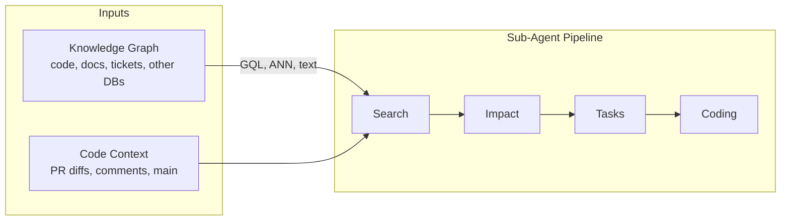
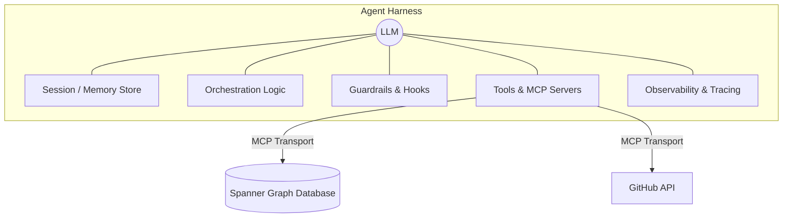
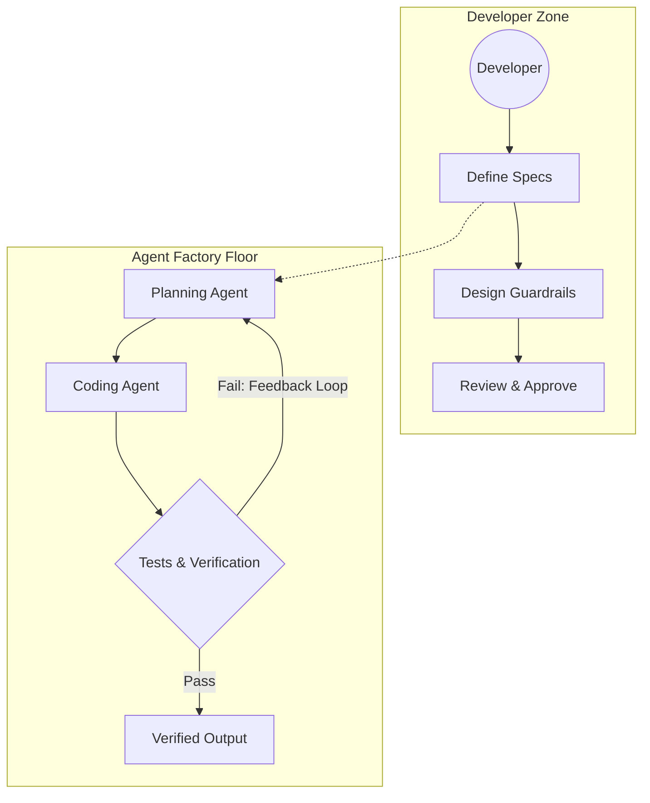

# VibeReview: Production-Ready Graph-Native Continuous Code Auditor

VibeReview is a "Tier 3" distributed multi-agent ADK pipeline operating over a Knowledge Graph to continuously audit repository code structures. Operating in a Zero-Trust environment, it integrates an active Red/Blue/Green security teaming architecture to detect code vulnerabilities, logic bombs, and intent drift, and automatically refactors issues within kernel-isolated sandboxes.

---

## 1. Problem Statement
Continuous code auditing at enterprise scale is exceptionally challenging due to the following reasons:
* **Complex Dependencies & Structural Blind Spots:** Monolithic LLM auditors analyze files in isolation, lacking the context of call graphs, database schemas, and ticket requirements.
* **Reputation & Repository Poisoning (Confused Deputy):** Autonomous agents can be manipulated via adversarial prompt injections to write backdoor exploits or import malicious dependencies.
* **PII & Secrets Leakage:** Agents reading developer logs or databases risk hallucinating and leaking Personally Identifiable Information (PII) or active credentials in prompt trajectories.
* **Intent Drift & Flaky Evals:** As workflows progress, agent trajectories can drift from the user's initial instructions, rendering traditional output-only assertions ineffective.

---

## 2. Solution: VibeReview
VibeReview solves these problems by decoupling orchestrations, context resolution, and active defense:
* **Graph-Native Context:** Incorporates a local Spanner Graph data gateway to allow agents to utilize structural graph traversals (GQL) and vector search (ANN).
* **Tier 3 Multi-Agent Pipeline:** Decomposes the audit flow into 5 specialized sub-agents coordinating via a sequential workflow graph.
* **Active Security Triad (Red/Blue/Green):** Protects the runtime via active injection testing, behavioral anomaly monitoring, and stateful quarantine remediation.
* **Zero-Trust Guardrails (Pillars 1, 2, 4, 5):** Establishes PII masking preprocessors, structural RBAC tool gating, and semantic LLM firewalls.

---

## 3. Architecture

### Multi-Agent ADK Pipeline
VibeReview implements a decomposed sub-agent pipeline utilizing the ADK 2.x Workflow graph:
```
[START] ➔ [Search Agent] ➔ [Story Agent] ➔ [Impact Agent] ➔ [Task-Breakdown Agent] ➔ [Coding Agent]
```
1. **Search Agent:** Queries the Spanner Graph database using GQL and Vector Search tools.
2. **Story Agent:** Fetches epic requirements, parsing requirements and user contexts.
3. **Impact Agent:** Analyzes call graphs and traces code modifications to predict downstream side-effects.
4. **Task-Breakdown Agent:** Partitions findings into atomic tickets and units of work.
5. **Coding Agent:** Generates refactoring edits, runs unit tests, and applies code fixes inside kernel-isolated sandboxes.

### Red/Blue/Green Security Triad
The runtime security is actively monitored by the following security roles:
* **Red Team (Attacker):** Injects adversarial vibes and hidden payloads to test if the primary agents can be compromised.
* **Blue Team (Defender):** Monitors input values and tool parameters for known signatures (e.g. `rm -rf`) to detect anomalies.
* **Green Team (Fixer):** Enforces a stateful quarantine on detection: immediately locks the agent status, revokes all tool access (raises a quarantined state exception), and triggers auto-refactoring/remediation.

### Model Context Protocol (MCP) Server Connections
VibeReview integrates local stdio-based subprocess connections to external systems:
* **Spanner Graph MCP (`graph_db_mcp`):** Connects to Spanner Graph for structural code retrieval and semantic vector lookups.
* **GitHub MCP (`github_mcp`):** Connects to repository pull requests and commits to monitor incoming PRs.

### Architecture Diagram


```mermaid
graph TD
    subgraph Active Defense Layer
        ID[Agentic Identity]
        VD[The Vibe Diff - MFA]
        RBG[Red, Blue, and Green Teaming]
    end
    
    subgraph Code & Execution Workflow
        NIA[Non-Interactive Access]
        SM[State Management]
        SIL[Shift Left IDE Linters]
        SB[Ephemeral Sandboxing] --- NIA
        EG[Egress Governance] --- NIA
        HPB[Hallucinated Package Blockers] --- SIL
        MS[MCP Spoofing Defense]
    end
    
    subgraph Agent Security Pillars
        P1[1. Infrastructure]
        P2[2. Data]
        P3[3. Model]
        P4[4. App & Runtime]
        P5[5. IAM]
        P6[6. Observability & SecOps]
        P7[7. Governance]
    end

    Active Defense Layer -.-> Code & Execution Workflow
    Code & Execution Workflow -.-> Agent Security Pillars
```





---

## 4. Setup & Running Instructions

Follow these step-by-step instructions to clone the repository, configure the environment, and run verification tools locally.

### Prerequisites
* **Python:** Version 3.11 or higher.
* **uv:** Fast Python package manager (Recommended). Install via:
  ```bash
  curl -LsSf https://astral.sh/uv/install.sh | sh
  ```

### Step 1: Clone the Repository
Clone the codebase and navigate to the project directory:
```bash
git clone <repository-url> vibe-review
cd vibe-review
```

### Step 2: Initialize Virtual Environment & Install Dependencies
Use `uv` to build the virtual environment and sync pinned dependencies:
```bash
# Creates the .venv and installs all dependencies from pyproject.toml
uv sync
```

### Step 3: Configure Environment Variables
Copy the environment template and configure your parameters:
```bash
cp .env.example .env
```
Open `.env` in your editor and configure the following variables:
* `GOOGLE_CLOUD_PROJECT`: Your Google Cloud Project ID.
* `GOOGLE_CLOUD_LOCATION`: Regional location (e.g., `us-central1`).
* `GITHUB_TOKEN`: GitHub Personal Access Token (for the GitHub MCP connection).
* `SPANNER_INSTANCE` & `SPANNER_DATABASE`: Spanner parameters.

### Step 4: Run Verification Tests
VibeReview has a comprehensive testing suite verifying the stateful quarantine, context masking, and Policy Server. Run pytest in the environment:
```bash
# Run unit tests locally (runs offline with mocked Google auth credentials)
.venv/bin/pytest tests/unit
```

### Step 5: Run Offline Evaluation Grading
To test the agent's trajectory quality, safety compliance, and task success across all BDD scenarios without needing active Vertex AI API keys, execute the evaluation pipeline locally:
```bash
# 1. Generate the conforming BDD scenario traces JSON
.venv/bin/python tests/eval/generate_mock_traces.py

# 2. Grade the traces against our custom Python-based metrics
.venv/bin/python -c '
import google.auth
import google.auth.credentials
google.auth.default = lambda **k: (google.auth.credentials.Credentials(), "dummy-project")
from google.agents.cli.eval.cmd_grade import cmd_grade
cmd_grade.callback(
    traces_path="artifacts/traces/traces_quarantine.json",
    output_path="artifacts/grade_results",
    config_path="tests/eval/eval_config.yaml",
    project="dummy-project",
    region="global"
)
'
```
You can inspect the generated HTML scorecard at `artifacts/grade_results/results_*.html`.

### Step 6: Start Local Playground
To interact with the agent pipeline and test prompts locally, start the playground:
```bash
.venv/bin/agents-cli playground
```
