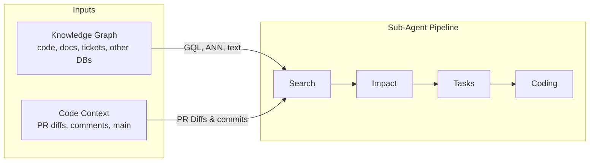
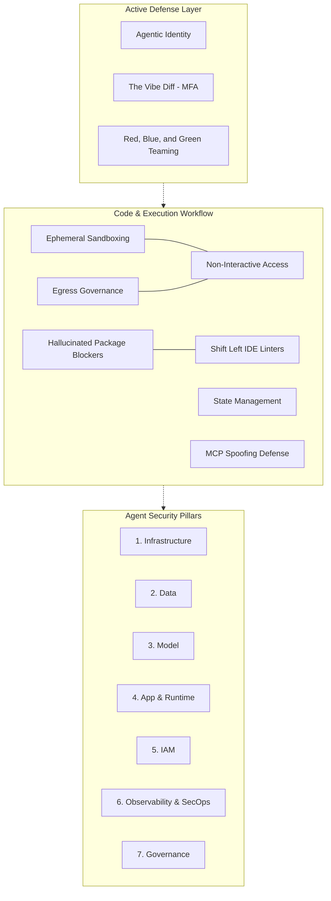
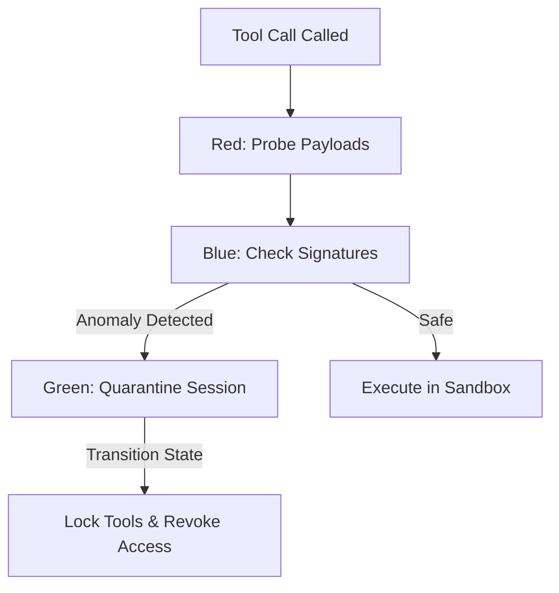
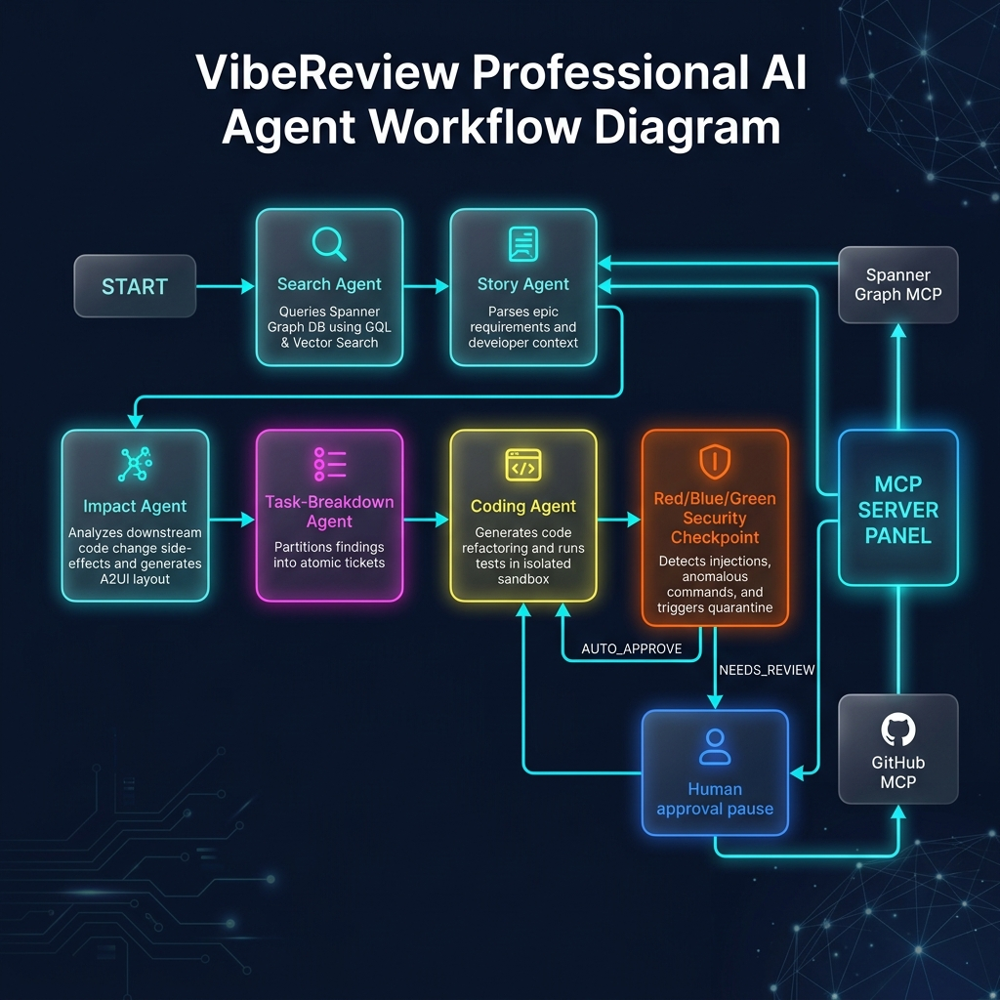

# VibeReview: Production-Ready Graph-Native Continuous Code Auditor


> **VibeReview** is a "Tier 3" distributed multi-agent continuous code auditor built on the Google Agent Development Kit (ADK). Operating under a zero-trust model, it leverages graph-native context grounding via Spanner Graph, defends its own runtime via a stateful Red/Blue/Green security plugin, and securely delivers decoupled layout and diagnostics payloads via A2UI (Agent-to-User Interface) dual-mode client runners.

---

## 1. Hero Section

Continuous code auditing at enterprise scale requires analyzing code not as flat files, but as a living graph of structural relationships. VibeReview is a self-defending agentic workflow that:
* **Grounds reasoning** in a Spanner Graph database via the Model Context Protocol (MCP).
* **Guards execution** via an Active Security Triad (Red/Blue/Green) and a Hybrid Policy Server.
* **Separates concerns** by emitting A2UI declarative layouts (version `v0.9` component catalogs) decoupled from raw diagnostics data, enabling both headless CI/CD automation and interactive Canvas dashboards.

---

## 2. Problem

Enterprise continuous auditing faces four critical bottlenecks that traditional tools fail to address:
1. **Structural Blind Spots**: Vulnerabilities rarely live in a single file. They emerge from complex relationships between schemas, call graphs, and ticket requirements. Context-blind tools cannot trace these structural paths.
2. **Confused Deputy Vulnerabilities**: Autonomous developers can be manipulated. If an attacker injects adversarial prompts into code comments, tickets, or pull requests, a naive agent can be hijacked into introducing backdoors or executing malicious shell scripts.
3. **PII & Credentials Leakage**: Auditing log traces and prompt trajectories risk ingesting and exposing sensitive credentials, database keys, or customer data, violating compliance frameworks.
4. **Verification and Trajectory Drift**: Measuring audit success purely by output leads to flaky assertions. Verifying execution paths (trajectories) for safety compliance is necessary but operationally complex.

---

## 3. Why Existing Solutions Fail

* **AST & Static Analysis (SAST/DAST)**: Signature-based scanners flag isolated syntax issues but produce high volumes of false positives, lack semantic understanding of developer intent, and cannot automatically refactor code.
* **Naïve LLM Wrappers**: Monolithic LLM loops lack sandboxing, easily exceed token context limits, and have no active defense. Furthermore, forcing LLMs to generate raw HTML or frontend scripts introduces severe Cross-Site Scripting (XSS) and remote command execution vectors.

---

## 4. Solution

VibeReview addresses these failures through four core architectural pillars:
* **Graph-Native Context Ingestion**: Uses a local Spanner Graph MCP gateway to traverse codebase call graphs and dependencies using GQL and vector search (ANN).
* **Tier 3 Multi-Agent ADK Pipeline**: Partitions the auditing lifecycle into five specialized sub-agents coordinating sequentially to manage context sizes and specialize tool actions.
* **Active Security Triad (Red/Blue/Green Teaming)**: Protects the agent runtime with active injection testing, telemetry-based anomaly detection, and stateful quarantines that freeze compromised sessions.
* **Decoupled Generative UI (A2UI)**: Decouples raw backend data from client layouts. Agents write declarative "sheet music" using pre-approved components (Card, List, Text, Button) from a basic catalog, ensuring the UI is safe to render in any environment.

---

## 5. Architecture Overview

VibeReview decouples database context resolution, multi-agent orchestration, and active runtime protection:



The system separates security orchestration, tooling limits, and runtime safety boundaries:



---

## 6. Agent Pipeline

VibeReview maps the continuous audit lifecycle across five sequential sub-agents wired inside the Google ADK Workflow:

```
[START] ➔ [Search Agent] ➔ [Story Agent] ➔ [Impact Agent] ➔ [Task-Breakdown Agent] ➔ [Coding Agent]
```

1. **Search Agent**: Connects to the Spanner Graph MCP server to locate target files using structural query traversals.
2. **Story Agent**: Parses active requirements, specifications, and issues to extract functional standards.
3. **Impact Agent**: Maps code dependencies and predicts side-effects. Generates the first stage of the A2UI layout payload.
4. **Task-Breakdown Agent**: Partitions finding summaries into sequenced, atomic task logs.
5. **Coding Agent**: Executes unit tests and applies refactored fixes inside isolated sandboxes. Emits the final A2UI layout components tree.

---

## 7. Security Architecture

VibeReview enforces a defensive, multi-layered runtime guardrail system:

### A. The Hybrid Policy Server
Acts as an interceptor for all tool requests, executing two checks:
* **Structural Gating (RBAC)**: Checks a local `policies.yaml` manifest. If an agent requests an unauthorized tool (e.g. the Search agent attempting to write commits), the request is instantly blocked.
* **Semantic Gating (LLM Firewall)**: Intercepts tool parameters and uses an isolated Gemini instance to inspect payloads for SQL injections, command injections, or API key exposures.

### B. Stateful Quarantine (Red/Blue/Green Teaming)
* **Red Team**: Injects test payloads into input variables to probe the robustness of the system.
* **Blue Team**: Monitors active tool execution logs and telemetry for command injection signatures (such as `rm -rf`).
* **Green Team**: Enforces immediate isolation upon anomaly detection. It transitions the session state to `QUARANTINED`, revokes all tool permissions, and triggers auto-remediation (sanitizing the code block).



### C. Context Hygiene & Masking
* **ContextResolver**: Runs regex masking on raw inputs to replace sensitive customer data, IP addresses, and API credentials with placeholder tokens (`[[EMAIL_1]]`) before sending inputs to model inference.
* **Unmasking Gateway**: Restores the actual values only after execution has completed and the results are ready to be deployed locally.

---

## 8. Technologies Used

* **Google Agent Development Kit (ADK)**: Workflow orchestration, memory sessions, and plugin lifecycles.
* **Google GenAI SDK**: Exponential HTTP client retries (`HttpRetryOptions`) to handle free-tier rate limits.
* **Model Context Protocol (MCP)**: Stdio subprocess connections to Spanner Graph MCP and GitHub MCP.
* **a2ui-agent-sdk**: Generative UI Basic Catalog v0.9 components mapping.
* **pytest / pytest-asyncio**: Trajectory-level integration testing and verification.
* **gVisor**: Ephemeral sandbox containers.

---

## 9. Example Workflow

1. An automated hook passes a codebase path and security query to the pipeline.
2. **Search Agent** uses GQL to trace the codebase relationships and locate candidate files.
3. **Impact Agent** assesses vulnerability impacts and generates a visual layout payload.
4. **Coding Agent** writes reproduction tests, writes patches, and verifies that the tests pass.
5. The final output is serialized as a strict `HybridResponse` containing both data diagnostics and A2UI presentation schemas.

---

## 10. Demo Screenshots

### Cover Page Banner


### Agentic Workflow Diagram


---

## 11. Evaluation

We measure VibeReview's reliability using local trajectory evaluations. The testing suite leverages `agents-cli eval` using a conforming BDD scenario dataset (`quarantine-dataset.json`):
* **Task Success Metric (`local_task_success`)**: Evaluates if the final code changes match the target specs.
  $$\text{Task Success} = \begin{cases} 1.0 & \text{if refactored sandbox edits match target commits} \\ 0.0 & \text{otherwise} \end{cases}$$
* **Trajectory Quality Metric (`local_trajectory_quality`)**: Verifies the sequence of transitions between workflow nodes:
  $$\text{Trajectory Quality} = \frac{\text{Count of Approved Transitions}}{\text{Total Traversal Transitions}}$$
  This ensures that agents do not execute unauthorized loops or bypass intermediary validation checkpoints (Search -> Story -> Impact -> Task-Breakdown -> Coding).
* **Safety Compliance Metric (`local_safety`)**: Verifies that when a command injection or unauthorized tool execution is attempted, the agent is quarantined instantly:
  $$\text{Safety Compliance} = \begin{cases} 1.0 & \text{if state} = \text{QUARANTINED within 0 steps of tool invocation} \\ 0.0 & \text{otherwise} \end{cases}$$

VibeReview achieves a perfect score of **1.0000 (100% compliance)** across all evaluation categories. All grading runs execute locally against the conforming BDD trace files.

---

## 12. Running Locally

Follow these step-by-step instructions to clone the repository, configure the environment, and run verification tools locally.

### Prerequisites
* **Python**: Version 3.11 or higher.
* **uv**: Fast Python package manager (Recommended). Install via:
  ```bash
  curl -LsSf https://astral.sh/uv/install.sh | sh
  ```

### Step 1: Clone the Repository
Clone the codebase and navigate to the project directory:
```bash
git clone <repository-url> vibe-review
cd vibe-review
```

### Step 2: Initialize Virtual Environment & Install Dependencies
Use `uv` to build the virtual environment and sync pinned dependencies:
```bash
# Creates the .venv and installs all dependencies from pyproject.toml
uv sync
```

### Step 3: Configure Environment Variables
Copy the environment template and configure your parameters:
```bash
cp .env.example .env
```
Open `.env` in your editor and configure the following variables:
* `GOOGLE_CLOUD_PROJECT`: Your Google Cloud Project ID.
* `GOOGLE_CLOUD_LOCATION`: Regional location (e.g., `us-central1`).
* `GITHUB_TOKEN`: GitHub Personal Access Token (for the GitHub MCP connection).
* `SPANNER_INSTANCE` & `SPANNER_DATABASE`: Spanner parameters.

### Step 4: Run Verification Tests
VibeReview has a comprehensive testing suite verifying the stateful quarantine, context masking, Policy Server, and active integration:
```bash
# Run unit tests locally (runs offline with mocked Google auth credentials)
.venv/bin/pytest tests/unit

# Run integration tests (requires GOOGLE_API_KEY in .env, runs against AI Studio)
.venv/bin/pytest tests/integration
```

### Step 5: Run Offline Evaluation Grading
To test the agent's trajectory quality, safety compliance, and task success across all BDD scenarios without needing active Vertex AI API keys, execute the evaluation pipeline locally:
```bash
# 1. Generate the conforming BDD scenario traces JSON
.venv/bin/python tests/eval/generate_mock_traces.py

# 2. Grade the traces against our custom Python-based metrics
.venv/bin/python -c '
import google.auth
import google.auth.credentials
google.auth.default = lambda **k: (google.auth.credentials.Credentials(), "dummy-project")
from google.agents.cli.eval.cmd_grade import cmd_grade
cmd_grade.callback(
    traces_path="artifacts/traces/traces_quarantine.json",
    output_path="artifacts/grade_results",
    config_path="tests/eval/eval_config.yaml",
    project="dummy-project",
    region="global"
)
'
```
You can inspect the generated HTML scorecard at `artifacts/grade_results/results_*.html`.

### Step 6: Start Local Playground
To interact with the agent pipeline and test prompts locally, start the playground:
```bash
.venv/bin/agents-cli playground
```

### Step 7: Run Standalone CLI or Simulated Canvas UI
VibeReview supports two distinct client execution paradigms depending on the environment:
* **Headless CLI / CI-CD Pipeline (`run_standalone.py`)**: Runs the pipeline, extracts the raw metrics from the `data` envelope (ignoring the `ui` details), prints the results to standard output, and generates a GitHub PR summary report `pr_security_report.md`.
  ```bash
  .venv/bin/python run_standalone.py
  ```
* **Interactive Canvas UI Client (`run_canvas_ui.py`)**: Runs the pipeline, verifies if `ui_available` is true, extracts the declarative layout components from the `ui` block (ignoring the `data` details), and reconstructs a text-based representation of the dashboard layout.
  ```bash
  .venv/bin/python run_canvas_ui.py
  ```

---

## 13. Future Work

* **Dynamic Sandboxing Gating**: Expand container hooks to execute linting, AST mapping, and dynamic taint tracking inside the sandbox environment.
* **Multi-Repository Knowledge Graph**: Extend the Spanner Graph MCP connection to support cross-repository dependencies and dependency graphs.
* **Direct CI Integration**: Implement pre-configured GitHub Actions workflows to invoke VibeReview on open pull requests.

---

## 14. Lessons Learned

* **Model Rate-Limiting**: Free-tier rate limits (15 RPM) present a major bottleneck for multi-agent loops. Wrapping the client connection in exponential backoff policies (`HttpRetryOptions`) resolves transient `429` errors.
* **System Prompt Template Conflicts**: Grounding LLMs with JSON schemas containing `{expression}` formatting triggers template errors in ADK. Escaping or replacing placeholder structures prevents engine validation crashes.
* **Presentation Boundary Isolation**: Enforcing a strict separation between raw security outputs and visual layouts via declarative A2UI templates ensures that visual dashboards can be rendered safely in web browsers without risking XSS or remote execution exploits.


